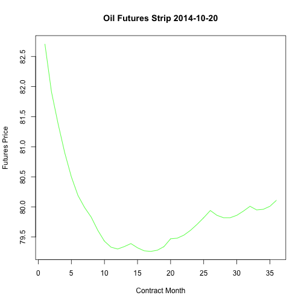

DDP Final
========================================================
title: "Oil Contango"
author: Rajiv Sharma
date: 03/20/16
autosize: true

---
output:
  html_document:
    css: assets/css/custom.css
    fig_caption: no
    fig_height: 3
    fig_width: 5
    highlight: default
    keep_md: no
    number_sections: no
    theme: default
    toc: yes
---
---

Oil Contango
========================================================


- Current Oil Futures Strip can indicate Bullishness or Bearishness of Oil Prices
- A Contango or an upward sloping curve switching to Backwardation or a downward sloping curve can still indicate Bullishness
- A Backwardation or a downward sloping curve switching to a Contango or an upward sloping curve can still indicate Bearishness


What is Contango?
===========================================================

- A Shiny application that plots Oil Contango for specified dates 
        - Oil Futures price data on contracts for 36 forward months
        - Prices plotted for a given day represent a Oil Futures Strip 
        - A positively sloping curve, then Oil (or any commodity that exhibits that) is in Contango
        - A negatively sloping curve, then Oil is in Backwardation


Implications of Contango
===========================================================

- Contango implies that the market expects future prices to be higher which prompts producers to store the commodity for future sales depressing current demand
- Backwardation implies the market expects prices to be lower in the future prompting producers to store less and sell more today. Or producers may already have been pumping a lot of Oil recently - does not bode well for the current demand-supply situation and that prices of Oil could be heading south.
- "Flipping through" the historical dates can show where the curve changed the slope from Contango to Backwardation and vice versa and what followed with the Oil price thereafter. Look at the dates surrounding Oct 2014 to see how the curve changed and then Oil prices tumbled.


R Code for the plot
========================================================


```r
library(shiny)
library(zoo)
shinyApp(
ui = fluidPage(
  headerPanel("Oil Contango"),
  sidebarPanel(
       checkboxGroupInput("pick", "Time Period to Plot:",
                          c("10 years" = "1",
                            "5 years" = "2",
                            "1 year" = "3",
                            "1 month" = "4",
                            "5 days" = "5"), selected = "2"),
        dateInput("day", "Date:", value = as.Date("2014-10-20"))),
    
    mainPanel(
       plotOutput('myContango')
    )
),

server = function(input, output) {
           output$myContango <- renderPlot({
                   CL <- read.zoo("CL.csv", header = TRUE, check.names = FALSE)
                   pd <- data.frame(pick = c("1", "2", "3", "4", "5"), per = c(3650, 1825, 365, 30, 5))
                   pr <- pd[pd$pick == input$pick,2]
                   data <- window(CL, start = end(CL) - pr, end = end(CL))
                   sub <- t(data[as.Date(input$day)])
                   # Plotting that day's future strip
                   plot(sub, main = paste("Oil Futures Strip", input$day, sep=" "), type = "l", col = "green", xlab = "Contract Month", ylab = "Futures Price")})
           }
        )
```

A contango (or backwardation) curve!
========================================================



